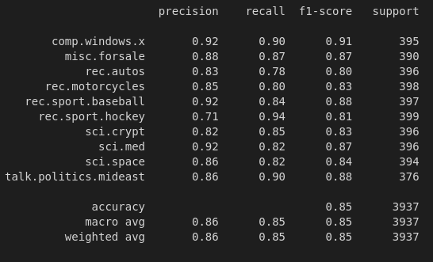
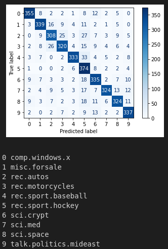

# Categorising news articles

An exploration into natural language processing by training models to categorise the contents of news articles, using both supervised and unsupervised techniques.

Submitted as coursework in my second year at the University of Bath.

## Supervised Approach - Multinomial Naive Bayes



The category with the lowest precision is `rec.sport.hockey`, i.e. articles written about hockey.
This suggestes this classifier has the lowest confidence when classifying these articles. There is a higher risk of false positives, and in turn we can't trust when it classifies an article re.sport.hockey.

The category with the lowest recall is `red.autos`, i.e. articles written about cars.
This suggests this classifier will have more false negatives in comparison with other categories. There's a higher chance it has missclassified an article as not part of this category.




Column 5 has average values outside of the diagonal, meaning it the has highest number of false positives out of any category. This corresponds to a low precision for category 5. If we check the 5th index in the labels list, we can see it corresponds to `rec.sport.hockey`, which as shown above does indeed have the lowest precision.

The row with the highest average values, ignoring the diagonal, is row 2. This means column 2 has the highest number of false negatives, corresponding to a low recall. Checking the list of labels, we see index 2 corresponds to `rec.autos` which, as shown above, is the class with the lowset recall.

Overall, this corresponds with the values found before and is relatively intuitive.

## Unsupervised Approach - KMeans Clustering

```
Clustering report:

* Homogeneity: 0.4761092040215425
* Completeness: 0.5290252073914884
* V-measure: 0.5011743057217702

Most discriminative words per cluster:
Cluster 0: 
israel jews israeli armenian arab people armenians jewish turkish arabs muslims war muslim said killed state government palestinian genocide peace palestinians world did turkey turks armenia rights just israelis population land like 000 soldiers human right anti children fact serbs don greek soviet think bosnian villages way does time country 

Cluster 1: 
doctor disease medical msg patients pain cancer cause food treatment know don people patient gordon drug geb skepticism pitt banks candida n3jxp dsl chastity cadre yeast like intellect shameful surrender health diet edu medicine body effects good soon does ve time help blood effect information problem infection kidney doctors just 

Cluster 2: 
window server motif use thanks application using display windows file widget program code x11r5 running does sun xterm problem set hi like color help run x11 know version mit openwindows screen files ve work user way manager want error client source advance unix just available include lib need xlib appreciated 

Cluster 3: 
sale 00 offer shipping condition asking new interested drive price email sell card original excellent edu mail 10 used best 25 monitor 50 brand cd meg includes 20 software manuals box obo following disks make disk included old like manual modem great model power ram 15 hard 40 printer floppy 

Cluster 4: 
space orbit nasa launch shuttle moon earth mission lunar solar satellite spacecraft hst like cost think program just station data use time mars science long years low satellites know new project dc don need idea sky missions sci sun rocket going technology large mass things high money power people orbital 

Cluster 5: 
thanks edu does com mail know think list new good information looking say did want time post address tell article send use used make university like email sure heard let years david cars info read need people got ve actually just ll believe thought really dod book probably stuff 10 

Cluster 6: 
key chip clipper encryption government keys nsa escrow algorithm use des phone security secure people public law crypto privacy encrypted secret don data just bit enforcement think phones chips number know using message used wiretap agencies make scheme like way rsa private trust serial court time strong does fbi police 

Cluster 7: 
car cars engine new ford dealer good like miles just know don speed does think ve price driving time buy drive power oil really convertible clutch rear 000 year owner driver used tires small insurance manual make mileage way problem auto got little looking bought want toyota right better great 

Cluster 8: 
game team games year hockey players season play think baseball win good don league player teams time like nhl espn did hit just fans better best really know years night series runs played going playoffs great playing pens won detroit pitching braves ll boston way fan toronto bad didn goal 

Cluster 9: 
just don like bike know think people right good ve time way really got ll make going say thing did ride use new sure does want long better little doesn didn things used work probably problem maybe riding lot real need let road thought look left years day said bikes 


Categories:
* comp.windows.x
* misc.forsale
* rec.autos
* rec.motorcycles
* rec.sport.baseball
* rec.sport.hockey
* sci.crypt
* sci.med
* sci.space
* talk.politics.mideast

```


Topic suggestions for each cluster:

Cluster 0: talk.politics.mideast

Cluster 1: sci.med

Cluster 2: comp.windows.x

Cluster 3: misc.forsale

Cluster 4: sci.space

Cluster 5: sci.med, sci.crypt, misc.forsale

Cluster 6: sci.crypt

Cluster 7: rec.autos

Cluster 8: rec.sport.hockey, rec.sport.baseball

Cluster 9: rec.motorcycles